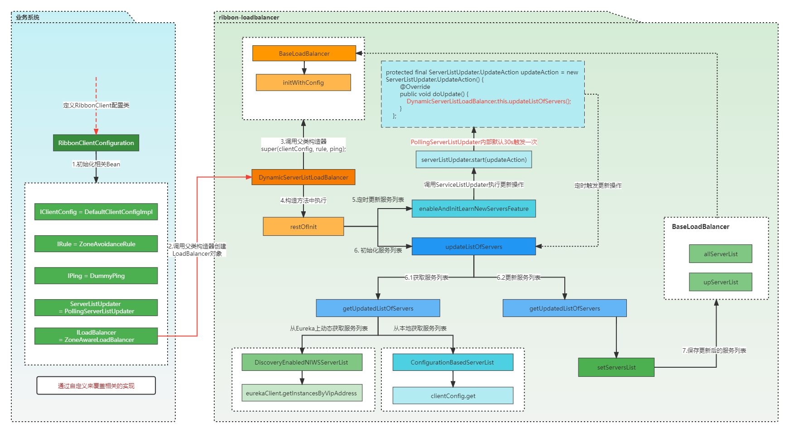
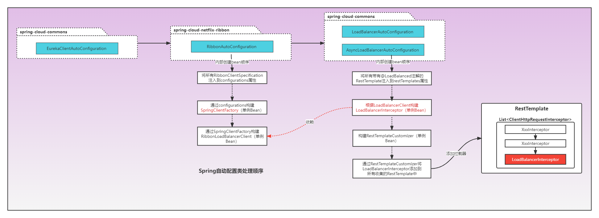

# ribbon
分析ribbon的使用和源码
## 为什么要使用Ribbon
其实，我们可以想想，**Ribbon更多地被用在内部调用，而这种场景由一个比较大的特点--目标服务为集群部署**。通常情况下，在调用目标服务时，我们希望请求尽可能平均地分发到每个实例。通过内置的负载均衡器，Ribbon可以很好的满足要求，而Apache HTTP client、Feign是无法做到的。
所以，在HTTP client里内置负载均衡器是为了能够在目标服务为集群部署时提供负载均衡支持。


## LoadBalancer（负载均衡器）
### 类图

### 主要组件介绍


| 组件 | 提供的功能 | 
| ---- | ----|
| Server | `server`表示服务的一个实例/节点，记录服务实例的相关信息。如：名称，服务地址
| ServerList | 维护一组`Serve`列表，在运行过程中，Ribbon通过ServerList提供服务实例供负载均衡器（ILoadBalancer）选择
| ServerStats | ILoadBalancer中为每个Server维护一个ServerStats，负责统计对应`Server`的运行情况。如：平均响应时间；累积请求失败次数；熔断时间控制等
| LoadBalancerStats | 作为`ServerStats`实例列表的容器，ILoadBalancer通过`LoadBalancerStats`统一维护。
| ServerListUpdater | ILoadBalancer通过`ServerListUpdater`来更新`ServerList`。
| Pinger | 服务状态检验器，负责维护`ServerList`列表中的服务状态注意：`Pinger`仅仅负责`Server`的状态，没有能力决定是否删除 |
| PingerStrategy |定义以何种方式还检验服务是否有效，比如是按照顺序的方式还是并行的方式 |
| IPing | 检验服务是否可用的方法，常见的是通过HTTP，或者TCP/IP的方式看服务有无认为正常的请求 |


**Ribbon负载均衡策略**


| 类名 | 描述 | 提供的功能 |
| ---- | ---- | ---- |
| RoundRobinRule | 线性轮询均衡 | 依次遍历服务列表获取实例处理请求。优点是无需记录当前所有连接的状态，无状态调度
| AvailabilityFilteringRule | 可用服务过滤负载均衡 | 
| WeightedResponseTimeRule | 加权响应时间负载均衡 | 为每个服务按响应时长自动分配权重，响应时间越长，权重越低，被选中的概率越低
| ZoneAvoidanceRule | 区域感知负载均衡 | 更倾向于选择发出调用的服务所在的托管区域内的服务，降低延迟，节省成本。(Spring Cloud Ribbon中默认的策略)
| RetryRule | 重试负载均衡 | 通过轮询策略选择一个服务节点，如果请求失败或响应超时，可以选择重试当前服务节点，也可以选择其他节点
| BestAvailableRule | 高可用均衡 | 忽略请求失败的服务器，尽量找并发较低的服务器。NOTE:这种会给服务器集群带来成倍的压力
| RandomRule | 随机负载均衡 | 随机选择服务器。适合并发比较大的场景
### 工作原理


## SpringCloud整合Ribbon原理
引入依赖:[github地址](https://github.com/spring-cloud/spring-cloud-netflix/tree/v2.1.6.RELEASE)
```xml
<dependency>
    <groupId>org.springframework.cloud</groupId>
    <artifactId>spring-cloud-starter-netflix-ribbon</artifactId>
</dependency>
```
### 基础知识
- SpringBoot自动配置原理
- @Import注解原理

### Ribbon初始化过程


我们是以自动装配的方式来初始化Ribbon的，所以我们需要找到对应jar包/META-INF/spring.factories文件中配置的自动配置类XxxAutoConfiguration。


**RibbonAutoConfiguration定义**
```java
@Configuration
@Conditional(RibbonAutoConfiguration.RibbonClassesConditions.class)
@RibbonClients
@AutoConfigureAfter(name = "org.springframework.cloud.netflix.eureka.EurekaClientAutoConfiguration")
@AutoConfigureBefore({ LoadBalancerAutoConfiguration.class, AsyncLoadBalancerAutoConfiguration.class })
@EnableConfigurationProperties({ RibbonEagerLoadProperties.class, ServerIntrospectorProperties.class })
public class RibbonAutoConfiguration {
    // 省略内部实现
}
```

根据`@AutoConfigureBefore`和`@AutoConfigureAfter`注解，我们可以推断出下面自动配置类的处理顺序

**其中有个重点的类`SpringClientFactory`，然后依次创建`RibbonLoadBalancerClient`,`LoadBalancerRequestFactory`,`LoadBalancerInterceptor`，最后将拦截器添加到`RestTemplate`**

**SpringClientFactory&NamedContextFactory**
`SpringClientFactory`继承由spring-cloud-context提供的`NamedContextFactory`,通过类上注释我们可以得知，可以通过`NamedContextFactory`定制化spring子容器，每个容器中的bean是通过`Specifications`的实现类定义（其本质是个配置类--类上有@Configuration注解）
**NamedContextFactory定义**
```java
public abstract class NamedContextFactory<C extends NamedContextFactory.Specification>
		implements DisposableBean, ApplicationContextAware {
    private final String propertySourceName;
	private final String propertyName;
    // 子容器名<-->Specification， 最终每个Specification会对应创建一个AnnotationConfigApplicationContext
	private Map<String, C> configurations = new ConcurrentHashMap<>();
    // 根据上面Specification创建子容器，最终放置该字段
    private Map<String, AnnotationConfigApplicationContext> contexts = new ConcurrentHashMap<>();
    // 指向父容器
	private ApplicationContext parent;
    // 默认配置
	private Class<?> defaultConfigType;

    // 唯一构造方法
    public NamedContextFactory(Class<?> defaultConfigType, String propertySourceName,String propertyName) {
        this.defaultConfigType = defaultConfigType;  // 提供的默认配置类，最终会被注册到子容器  
        this.propertySourceName = propertySourceName;  // 子容器中的propertySource名字
        this.propertyName = propertyName;
    }

    // 通过该方法完成子容器信息的注入，由Specification来具体定义每个子容器bean的信息
    public void setConfigurations(List<Specification> configurations) {
		for (C client : configurations) {
			this.configurations.put(client.getName(), client);
		}
	}
    // 获取指定名字的子容器
    protected AnnotationConfigApplicationContext getContext(String name) {}
    // 根据子容器名称(name)从子容器获取一个指定类型(type)的实例，如果此时子容器不存在则创建子容器
    public <T> T getInstance(String name, Class<T> type) {}
    // 创建指定名字(name)的子容器 注册beanDefinition->设置propertySource->设置父容器->刷新容器
    protected AnnotationConfigApplicationContext createContext(String name) {}
}
```
NamedContextFactory功能小结：提供唯一一个构造器去供子类调用，需要指定默认配置，属性源及属性名称。通过`setConfigurations(List<Specification> configurations)`来注入原始信息，`NamedContextFactory`根据名字进行区分管理，并且支持根据`Specification`创建对应子容器
**SpringClientFactory定义**
```java
public class SpringClientFactory extends NamedContextFactory<RibbonClientSpecification> {

	static final String NAMESPACE = "ribbon";

	public SpringClientFactory() {
		super(RibbonClientConfiguration.class, NAMESPACE, "ribbon.client.name");
	}
}
```
通过上面调用父类构造器可知，是由`RibbonClientConfiguration`提供默认配置的,查看源码可知默认配置如下表：

|组件名称|默认配置| 描述 |
|----|----|----|
| IRule | ZoneAvoidanceRule | 均衡策略
| IPing | DummyPing | 检查服务健康状况
| ServerList | ConfigurationBasedServerList | 获取服务列表
| ServerListUpdater | PollingServerListUpdater | 定时更新服务列表
| ILoadBalancer | ZoneAwareLoadBalancer | 负载均衡
| ServerListFilter | ZonePreferenceServerListFilter | 服务列表过滤


### 拦截请求原理
通过上面的分析，我们知道是通过给`RestTemplate`注入了一个`LoadBalancerInterceptor`拦截器，发送请求时被拦截器拦住走Ribbon的逻辑--选取对应服务的一个实例，再真正发送请求。大致流程如下：


## 总结
Ribbon是Spring Cloud框架中相当核心的模块，负责着服务负载调用，Ribbon也可以脱离SpringCloud单独使用。
另外Ribbon是客户端的负载均衡框架，即每个客户端上，独立维护着自身的调用信息统计，相互隔离；也就是说：Ribbon的负载均衡表现在各个机器上变现并不完全一致
Ribbon 也是整个组件框架中最复杂的一环，控制流程上为了保证服务的高可用性，有很多比较细节的参数控制，在使用的过程中，需要深入理清每个环节的处理机制，这样在问题定位上会高效很多